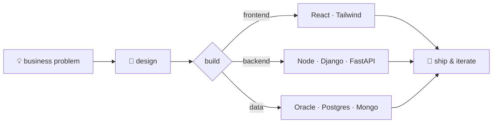

<div align="center">

# Sahil Ali

[](https://git.io/typing-svg)

[](https://sahil-ali27.netlify.app)
[](https://linkedin.com/in/sahilali8210)
[](mailto:alisahil8210@gmail.com)

</div>

```typescript
const sahil = {
  role:      "Full Stack Software Developer @ Minu Marketing Pvt. Ltd.",
  education: "MCA — BIT Mesra",
  builds:    ["scalable web apps", "REST APIs", "automation platforms"],
  currently: "modernizing legacy systems → performance · security · reliability",
  exploring: "AI-powered solutions & workflow automation",
} as const;
```

### `$ workflow --show`



### `$ stack --list`

<details open>
<summary><b>&nbsp;languages</b></summary>
<br/>


</details>

<details>
<summary><b>&nbsp;frontend</b></summary>
<br/>


</details>

<details>
<summary><b>&nbsp;backend</b></summary>
<br/>


</details>

<details>
<summary><b>&nbsp;databases</b></summary>
<br/>


</details>

<details>
<summary><b>&nbsp;tooling</b></summary>
<br/>


</details>

### `$ skills --graph`

```text
full-stack development   ████████████████████  expert
rest api design          ███████████████████░  advanced
database engineering     ██████████████████░░  advanced
automation & ai          ████████████████░░░░  proficient
devops & deployment      ███████████████░░░░░  proficient
```

### `$ github --stats`

<div align="center">


<picture>
  <source media="(prefers-color-scheme: dark)" srcset="https://raw.githubusercontent.com/AlixSahil/AlixSahil/output/github-contribution-grid-snake-dark.svg"/>
  <source media="(prefers-color-scheme: light)" srcset="https://raw.githubusercontent.com/AlixSahil/AlixSahil/output/github-contribution-grid-snake.svg"/>
  
</picture>

</div>

---

<div align="center">
<sub><code>while (alive) { learn(); build(); ship(); }</code></sub>
</div>
